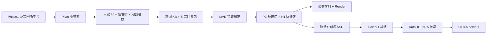

# 阿嫲的小管家 · 从零到一制作复盘

> 供人回顾，也供后续 Cursor Agent / 协作者按阶段接续。  
> 产品名：**阿嫲的小管家（Nana Teochew Agent）**  
> 赛道：EazO Personal Agent · 上海赛区初赛（提交约 2026-08-10）  
> 线上：https://nana-teochew-agent.onrender.com  
> 仓库：https://github.com/barewchiu/nana-teochew-agent  

本文不是逐日流水账，而是**决策顺序 + 可复用步骤 + 关键文档指针**。细节以各专题文档为准。

---

## 0. 一句话产品定义

为**只会潮汕话**的阿芳奶奶做的 Personal Agent：  
孙子普通话留言 → 乡音念给她听；她用潮语跟管家说话；吃药提醒 + 潮剧/电台娱乐。  
核心不是教老人用 App，而是让数字世界听懂奶奶。

---

## 1. 总览：做过的阶段（按时间线）



| 阶段 | 目标 | 产出状态 |
| --- | --- | --- |
| Phase 1 | 方言数字包容平台原型 | 已归档，不作为主产品 |
| Pivot | 缩到「一个具体人」 | 三键叙事与 brief |
| 产品骨架 | 可演示的 Web App | Render 公网可开 |
| 对话质量 P1–P4 | LIVE/演示稳、有乡音 | **线上已接** |
| 提交 | Hirebox 初赛 | ZIP + 表单已交 |
| ASR 路线 4 | 潮语耳长期方案 | Holdout **93.8%**；**尚未接 LIVE 主路径** |

---

## 2. Phase 0 → Phase 1：原点（归档）

**做过什么**

- 早期项目名「乡音回响 / Echo of Roots」：偏平台、多模块。
- 报名阶段有独立 brief 与开发总结。

**为何 pivot**

- 黑客松窗口短，平台叙事难交付、难演示。
- 「服务一个具体奶奶」比「服务全体方言老人」更易讲清、更易做深。

**参照**

- `docs/Pivot_To_Nana_Agent.md`
- `docs/archive/phase1/`
- 代码归档：`nana-agent/_archive/phase1/`（若存在）

**给后续 Agent 的指令**

- 不要把 Phase 1 平台功能默认恢复到主 UI。
- 主产品只认 `nana-agent/` 三键路径。

---

## 3. Pivot：定人设与三键法则

**关键决策**

1. 人设：小管家 = 孙子的数字化身，语气孝顺、潮语陪伴。  
2. UI：**三超大键** — 听孙子的信 / 跟管家讲话 / 听潮剧。  
3. 成功标准：评委 1 分钟能走通有声音的路径。

**实施入口**

- Brief：`docs/Pivot_To_Nana_Agent.md`
- 分步 UI/留言桥/潮剧：`docs/Nana_Agent_实施指南.md`

**技术落点（至今仍核心）**

| 能力 | 实现要点 |
| --- | --- |
| 留言桥 | 普通话文案 → 预录潮语音频（Voice Echo） |
| 吃药提醒 | 打开时弹窗 + 乡音提醒 |
| 潮剧 | 苏六娘 / 告亲夫选段预览 |
| 电台 | 页内澄海 FM（蜻蜓流）+ 备用 |

主代码：`nana-agent/src/App.jsx`、`nana-agent/backend/main.py`

---

## 4. 产品骨架：可运行与可部署

**重要步骤**

1. 前端：React + Vite + Tailwind（适老大按钮）。  
2. 后端：FastAPI；Ear≈Groq Whisper（普通话模型）；Brain≈DeepSeek / Groq。  
3. 一体 Docker：`nana-agent/Dockerfile` + `render.yaml` → 一 URL 部署。  
4. 环境变量：`GROQ_API_KEY`、`DEEPSEEK_API_KEY`（不进 git）。

**运维注意**

- Render 免费实例会休眠；首开约 1 分钟属正常。  
- 提交文案与检查清单：`docs/SUBMIT.md`。

---

## 5. 对话质量线（P1–P4）——演示真正稳下来的路径

瓶颈一开始就清楚：**普通话 Whisper 听潮语会乱码**。策略是「产品先稳，ASR 长期跟」。

### P1 · 乡音回复包

- 家人录短句潮语回复 → `nana-agent/public/audio/replies/{intent}.m4a`
- 意图命中优先播原声，而不是冷冰冰 TTS。
- 文档：`docs/乡音回复录音包.md`
- 后补：`affection.m4a`（想念/喜欢，不再借用 thanks）

### P2 · LIVE 错读纠正

- 真人潮语 LIVE 测，把 Whisper 乱码记表。
- `MISHEAR_CORRECTIONS` + 意图关键词 + LLM 意图兜底。
- 多轮加固后抽测可达可用；文档：`docs/LIVE测试错读记录.md`
- 代码：`nana-agent/backend/teochew_rag.py`

### P3 · 短多轮记忆

- 前端带最近若干轮 `history`；后端 `match_followup`。
- 解决「食了 / 还没」等续话。
- 文档：`docs/P3短多轮记忆.md`

### P4 · 场景快捷钮

- 不依赖麦克风的演示入口（食饱未、吃药、天气等）。
- **评委演示主路径应优先快捷钮**，LIVE 作加分。
- 文档：`docs/P4场景快捷钮.md`
- 前端：`nana-agent/src/lib/chatKb.js`

**原则（写给后续开发）**

> 演示稳定性 > 技术炫技。未上线的潮语 ASR 不要写进「现网能力」宣传。

---

## 6. 意图与知识层

**做过什么**

- 规则意图 + 对话/词表模糊匹配（轻量 RAG）。
- 金标文本 → 意图可达 **100%**（holdout gold）。
- 说明：ASR 差时，意图层再好也救不了；ASR 好了意图层立刻变值钱。

**关键文件**

- `nana-agent/backend/teochew_rag.py`
- 语料：`data/` 下词汇/对话（及 agent 内 KB）

---

## 7. 路线 4：潮语 ASR（长期，与交卷并行）

目标：自己的潮语耳，替代普通话 Whisper。

### 7.1 数据与闸门

| 步骤 | 做什么 |
| --- | --- |
| Schema / L1 口令表 | `data/asr/SCHEMA.md`、`l1_commands/phrases.csv` |
| 家人录音 | `data/asr/l1_commands/audio/`（gitignore） |
| Manifest | `manifest.csv`；`split=train|holdout` |
| 锁定 holdout | **32 条永不训练**（`make_holdout.py`） |
| 评测脚本 | `teochew-asr/scripts/eval_holdout.py` |

文档：`docs/ASR_路线4_长期方案.md`、`docs/ASR_第0-2周看板.md`、`docs/ASR_Holdout评测.md`

### 7.2 基线数字（务必保留对照）

| 系统 | Holdout 意图准确率 |
| --- | ---: |
| gold（标注文本） | 100% |
| Groq 普通话 Whisper | 40.6% |
| 开源潮语 Whisper 零样本 | 50.0% |
| + L1 LoRA（36 train） | 84.4% |
| + gap-fill 后 LoRA（46 train） | **93.8%** |

详见：`docs/ASR_Holdout基线.md`

### 7.3 AutoDL 实操踩坑（复用清单）

1. Windows zip 反斜杠 → `unzip` 警告退出码 1 → bootstrap 需容忍。  
2. 中国区 HF → `HF_ENDPOINT=https://hf-mirror.com`。  
3. m4a → librosa/ffmpeg 转 16k waveform。  
4. 无系统 `python3` → miniconda。  
5. 按量实例关机后 GPU 可能被占 → **克隆实例**换宿主机。  
6. 训完立刻**关机**；密码勿提交仓库。

手册：`docs/ASR_AutoDL操作手册.md`、`docs/ASR_微调_L1.md`  
脚本：`teochew-asr/scripts/autodl_*.sh`、`finetune_whisper_l1.py`、`run_autodl_*.py`

### 7.4 未做完（明确债务）

- [ ] merged 权重部署为推理服务，接 `TEOCHEW_ASR_URL`  
- [ ] LIVE 主路径切换潮语 ASR（现网仍 Groq）  
- [ ] MCP 选填 +5（已主动放弃，交卷来不及）  
- [ ] L2 阿嫲域内数据  

可选接线上：后端已有 `teochew_asr` 开关字段（health 里曾见 `teochew_asr: false`）。

---

## 8. 交卷流程（已跑通）

1. 公网验收：三键有声 + 快捷钮；LIVE 加分。  
2. `cd nana-agent && npm run pack:submit` → `submit/*_submit_*.zip`（&lt;50MB，无 `.env`）。  
3. 头像：`submit/nana-agent-avatar.png`。  
4. Hirebox 表单：名称 / 简介 / 使用方式 / 体验链接；**MCP 留空**。  
5. 勾选授权 → 上传；提交后锁定。  

清单与文案：`docs/SUBMIT.md`

---

## 9. 仓库地图（给后续 Agent 快速定位）

```
nana-agent/           # 现网产品（优先改这里）
  src/App.jsx         # 三键 UI 与主状态
  src/lib/chatKb.js   # 快捷钮 / 回复包映射
  backend/main.py     # API、ASR、LLM
  backend/teochew_rag.py  # 意图、错读、记忆
  public/audio/       # 留言 / 回复 / 潮剧预览
  Dockerfile          # Render 一体部署

teochew-asr/          # ASR 服务 stub + 训练评测脚本
data/asr/             # L1/L2/holdout 数据（音频本地）
docs/                 # 方案与复盘（本文）
```

---

## 10. 决策原则（复盘提炼）

1. **具体人 > 大平台**：pivot 是胜负手。  
2. **演示路径与技术债分离**：快捷钮保命；ASR 慢慢炼。  
3. **Holdout 神圣不可侵犯**：永不拿测试集训练。  
4. **小数据靠近义补录 + LoRA**：比盲目加 epoch 有效。  
5. **产品补丁（错读表）便宜**：2 条乱听十分钟可补。  
6. **交卷不赌未上线能力**：MCP / 专用 ASR 来不及就砍。  
7. **云 GPU 用完即关**：账单与空闲卡抢占都真实。

---

## 11. 若从今天继续，推荐顺序

| 优先级 | 事项 |
| --- | --- |
| P0 | 保持 Render 在线，等初赛结果 |
| P1 | 部署 LoRA merged → `TEOCHEW_ASR_URL`，A/B LIVE |
| P2 | 继续补 L1 近义句 / L2 阿嫲录音 |
| P3 | 适老化与无障碍打磨；可选 MCP |

新开 Agent 会话时可说：

> Read `docs/制作复盘_从零到一.md` and continue from section 11 / 7.4 debt.

---

## 12. 专题文档索引

完整列表见 [`docs/README.md`](./README.md)。与本复盘强相关：

| 文档 | 用途 |
| --- | --- |
| Pivot / 实施指南 | 为何转型、怎么改 UI |
| 乡音回复 / LIVE / P3 / P4 | 对话质量四步 |
| ASR 路线 4 / 看板 / Holdout / AutoDL / 微调 | 潮语耳全流程 |
| SUBMIT | 交卷清单与粘贴文案 |

---

*文档生成语境：初赛提交完成后复盘（约 2026-08）。若主路径或基线变更，请同步改第 7.2 节与第 7.4 节勾选状态。*
